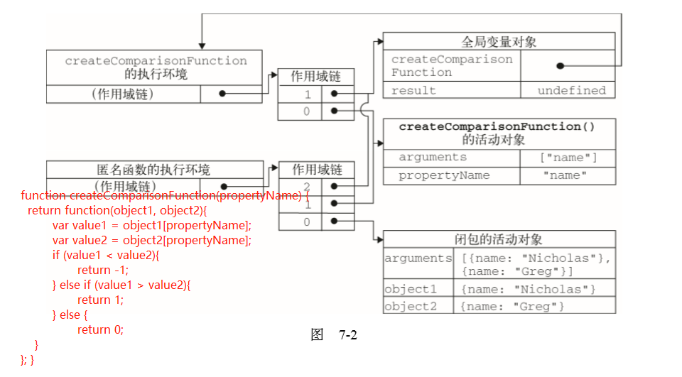

## 函数表达式

### 递归

```
function factorial(num){     
  if (num <= 1){         
    return 1;
  } else {
    return num * factorial(num-1);
  }
} 

// 问题
var anotherFactorial = factorial;
factorial = null;
anotherFactorial(); // 报错
```
#### 非正式的解决方案 `arguments.callee`

`arguments.callee` 是一个指向正在执行的函数的指针

```
function factorial(num){
  if (num <= 1) {
    return 1;
  } else {
    return num * arguments.callee(num-1);     
  }
}
```

> **注意**： 在严格模式下会导致错误，并且`auguments`是个很大的对象，频繁创建会造成浏览器性能损耗

#### 终极解决方案

申明一个函数，添加函数名称，调用此函数名称就可以

```
var factorial = (function f(num){
  if (num <= 1) {
    return 1;
  } else {
    return num * f(num-1);
  }
}); 
```

### 闭包

#### 定义

有权访问另一个函数作用域中的变量的函数。（只能是包含关系的函数，并且引用了外部函数的变量）

#### 环境、作用域

`js` 只有两种环境，全局环境、函数环境

#### 函数作用域

一个函数在执行的时候，会创建一个作用域链，第一位置始终保存的是函数的活动对象（声明变量，参数变量），第二位置保存外部函数活动对象（内部函数引用了外部函数变量），以此类推，直到全局作用域。

作用域图片示例：


#### 块级作用模仿域

使用匿名函数可以创建一个块级作用模仿域

```
(function() {
  // 这里是块级作用域
}())
```

#### 闭包的内存泄露

以下会造成内存泄露
- 循环引用（在**引用计数**模式中不会清除，但是在**标记清除**模式中可以清除）
```
function func(){
  var element = document.getElementById('id');
  
  element.onclick = function() {
    var id = element.id;
  }
}
```

- 将闭包赋值给全局变量
```
function func() {
  var element = document.getElementById('id');

  return function(){
    var id = element.id;
  }
}

var callback = func();
```

闭包不会引起内存泄漏：
- 由匿名函数引起的闭包
```
function func(count) {
  (function() {
    for(var i = 0;i < 10; i++) {
      alert(i);
    }
  }())
}
```

**总结**：在标记清除模式中，只有被全局作用域的变量**直接引用**或者**间接引用**（全局对象的某个子属性引用），内存是无法释放的，其他的都可以释放。


